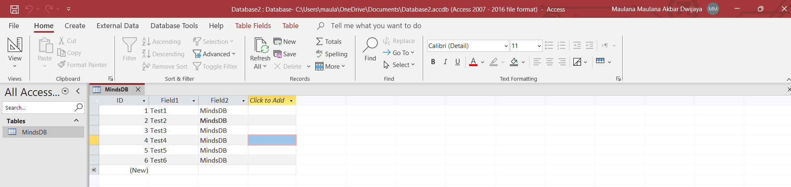
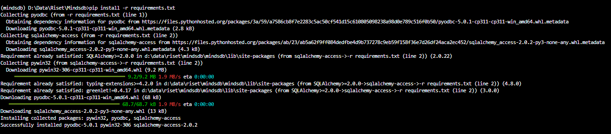
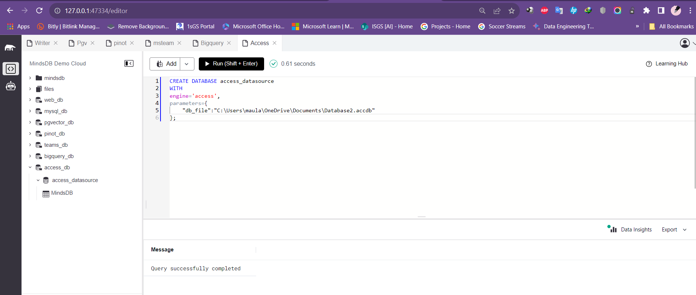
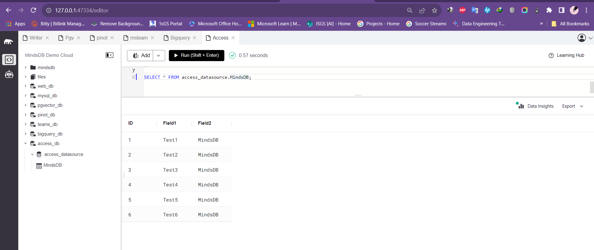

# Test the Microsoft Access data integration

This README provides instructions for testing the Microsoft Access data integration in MindsDB.

For more details, refer to the related [GitHub Issue](https://github.com/mindsdb/mindsdb/issues/7978) and the [Microsoft Access documentation](https://github.com/mindsdb/mindsdb/blob/staging/mindsdb/integrations/handlers/access_handler/README.md) in the MindsDB documentation.

## Test Cases Microsoft Access

-----
### 1. Install the Microsoft Access handler dependencies

**Screeshot Result: Successfully installed**

-----
### 2. Create a Microsoft Access integration on MindsDB 

**Description:**
To use this handler and connect to the Microsoft Access in MindsDB.

**Screeshot Result: Query successfully completed**

-----

### 3. Query Microsoft Access Database

**Screeshot Result: Query successfully completed**

-----

## Result

The Microsoft Access integration has been successfully tested, and all test cases are working as expected.
