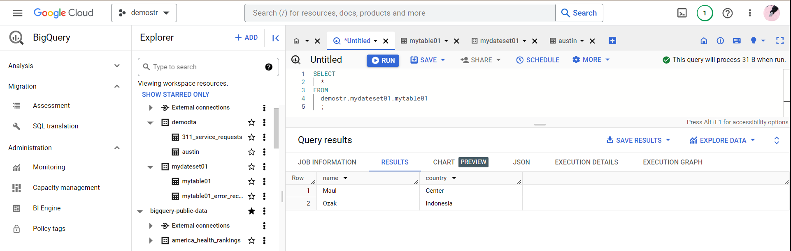
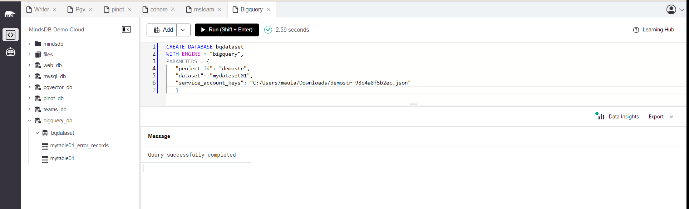
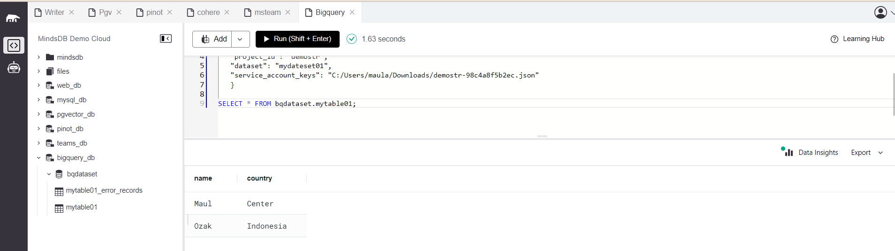
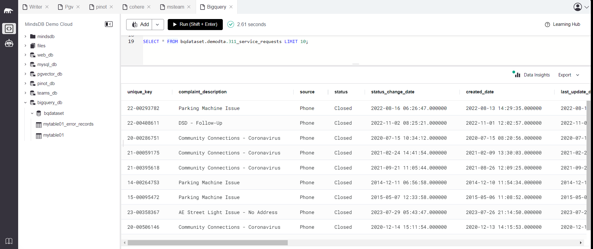

# Test the Google Big Query data integration

This README provides instructions for testing the Big Query data integration in MindsDB.

For more details, refer to the related [GitHub Issue](https://github.com/mindsdb/mindsdb/issues/7644) and the [Big Query documentation](https://docs.mindsdb.com/integrations/data-integrations/google-bigquery) in the MindsDB documentation.

## Test Cases Big Query

-----
### 1. Create a Big Query Datasource on MindsDB 

**Description:**
To use this handler and connect to the Big Query in MindsDB.

**Screeshot Result: Query successfully completed**

-----

### 2. Query Big Query Datasource

**Screeshot Result: Query successfully completed**

-----

### 3. Query other dataset Big Query in the same project

**Screeshot Result: Query successfully completed**

-----

## Result

The Big Query data integration has been successfully tested, and all test cases are working as expected.
