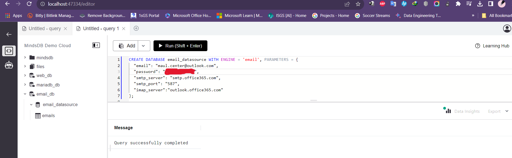
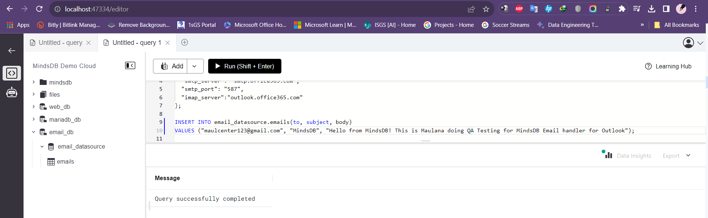
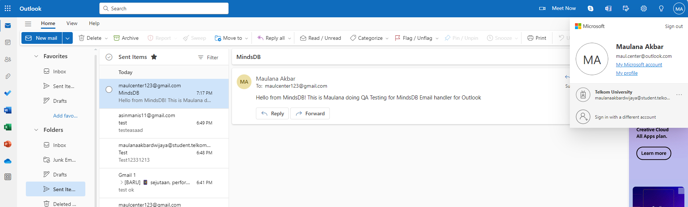
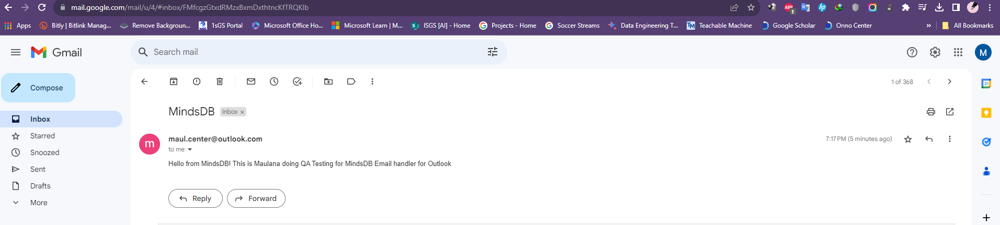

# Testing the Email Handler with different provider (Outlook).

[GitHub Issue Link](https://github.com/mindsdb/mindsdb/issues/7599)

For reference: [GitHub Handler Documentation](https://github.com/mindsdb/mindsdb/tree/staging/mindsdb/integrations/handlers/email_handler#github-handler).

## Test Cases

### Outlook Email Integration

#### Description
This test case examines the integration of the Email handler with Outlook email accounts.
```sql
   CREATE DATABASE email_datasource WITH ENGINE = 'email', PARAMETERS = { 
     "email": "youremail@outlook.com", 
     "password": "yourpassword", 
     "smtp_server": "smtp.office365.com", 
     "smtp_port": "587", 
     "imap_server": "outlook.office365.com" 
   };
```

Screeshot Result: Query successfully completed



----- 
#### Send emails:
```sql
INSERT INTO email_datasource.emails(to, subject, body)
VALUES ("toemail@gmail.com", "MindsDB", "Hello from MindsDB! This is Maulana doing QA Testing for MindsDB Email handler for Outlook")
```
Screeshot Result: Query successfully completed



----- 
#### Check email sending history in Outlook:



----- 
#### Check the email inbox for the sends email query:



----- 
### Result: 
Test the Email handler using Outlook cases are working fine.
