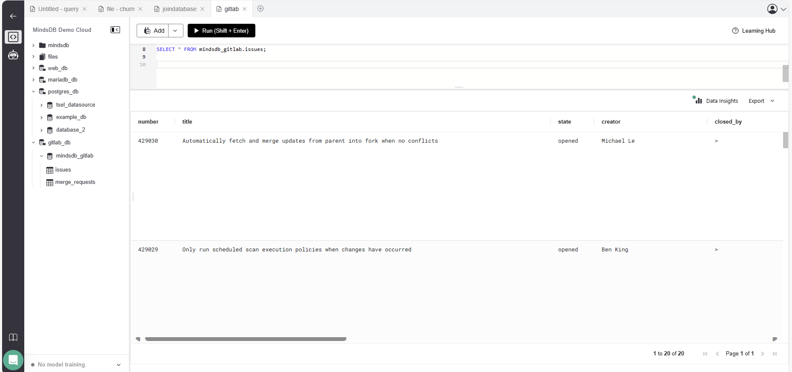

# Test the Gitlab app integration

This README provides instructions for testing the Gitlab app integration in MindsDB.

For more details, refer to the related [GitHub Issue](https://github.com/mindsdb/mindsdb/issues/7977) and the [Gitlab Handler documentation](https://github.com/mindsdb/mindsdb/blob/staging/mindsdb/integrations/handlers/gitlab_handler/README.md) in the MindsDB documentation.

## Test Cases Gitlab app integration

-----
### 1. Install the Gitlab handler dependencies

**Screeshot Result: Successfully installed**

-----
### 2. Create a Gitlab app integration on MindsDB 

**Description:**
To use this handler and connect to the Gitlab app in MindsDB.

**Screeshot Result: Query successfully completed**

-----

### 3. Query Table Gitlab app integration

**Screeshot Result: Query successfully completed**

-----

## Result

The Gitlab app integration has been successfully tested, and all test cases are working as expected.
