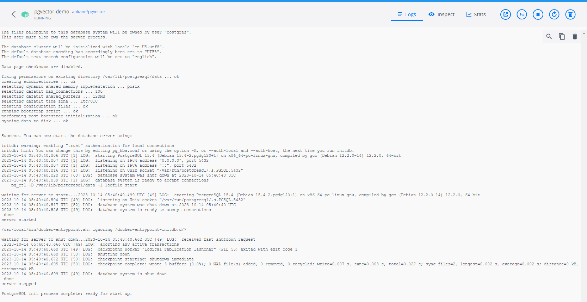
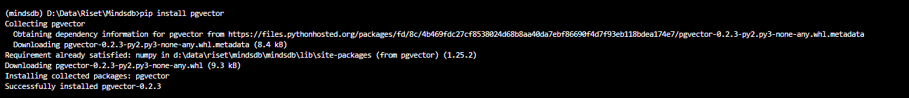
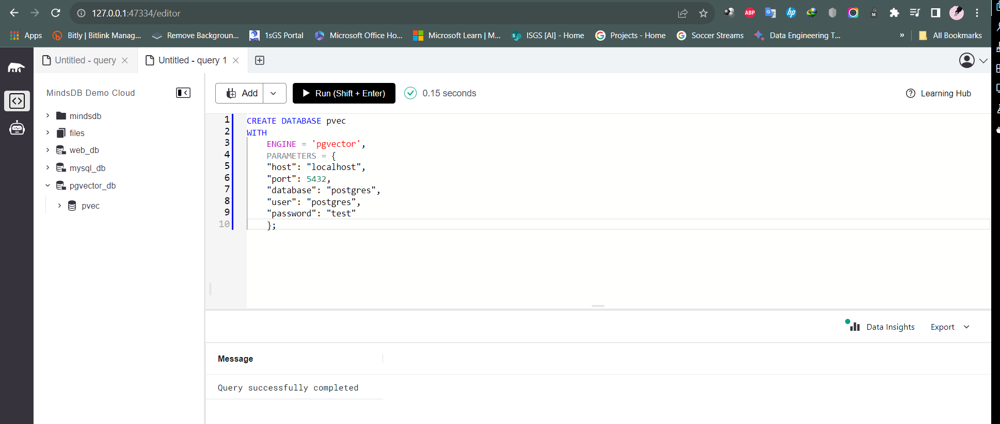
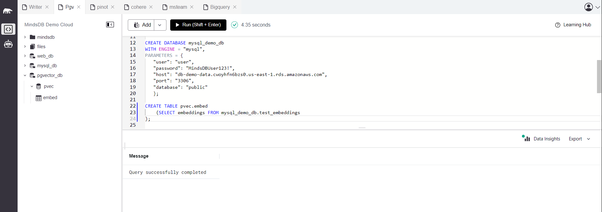
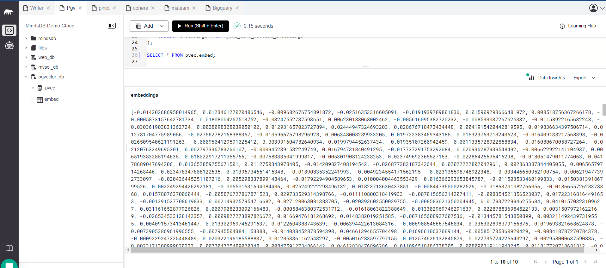
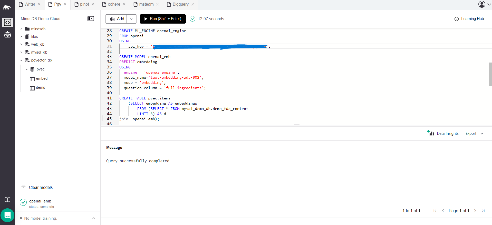
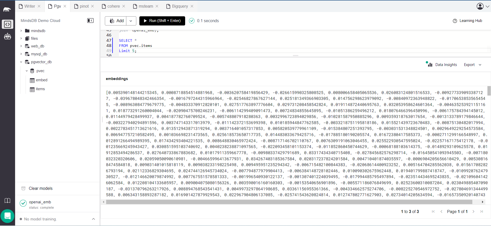

# Test the PGVector data integration

This README provides instructions for testing the PGVector data integration in MindsDB.

For more details, refer to the related [GitHub Issue](https://github.com/mindsdb/mindsdb/issues/7758) and the [PGVector documentation](https://github.com/mindsdb/mindsdb/blob/staging/mindsdb/integrations/handlers/pgvector_handler/README.md) in the MindsDB documentation.

## Test Cases PGVector



-----
### 1. Install the PGVector handler dependencies

**Screeshot Result: Successfully installed**



-----
### 2. Create a PGVector integration on MindsDB 

**Description:**
To use this handler and connect to the PGVector in MindsDB.

**Screeshot Result: Query successfully completed**



-----

### 3. Query a collection PGVector 

```sql
CREATE TABLE pvec.embed
    (SELECT embeddings FROM mysql_demo_db.test_embeddings
);

CREATE ML_ENGINE openai
FROM openai
USING
    api_key = 'your-openai-api-key';

CREATE MODEL openai_emb 
PREDICT embedding 
USING    
  engine = 'openai',
  model_name='text-embedding-ada-002',    
  mode = 'embedding',    
  question_column = 'review'; 

create table pvec.itemstest (
SELECT m.embedding AS embeddings, t.review content FROM  mysql_demo_db.amazon_reviews t
  join openai_emb  m
);
```

**Screeshot Result: Query successfully completed**






-----

## Result

The PGVector  integration has been successfully tested, and all test cases are working as expected.
