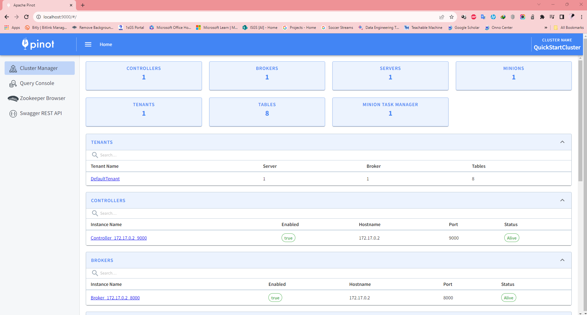
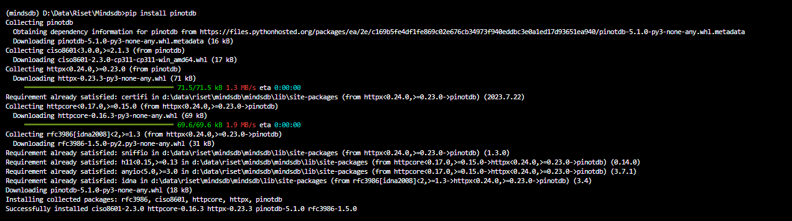
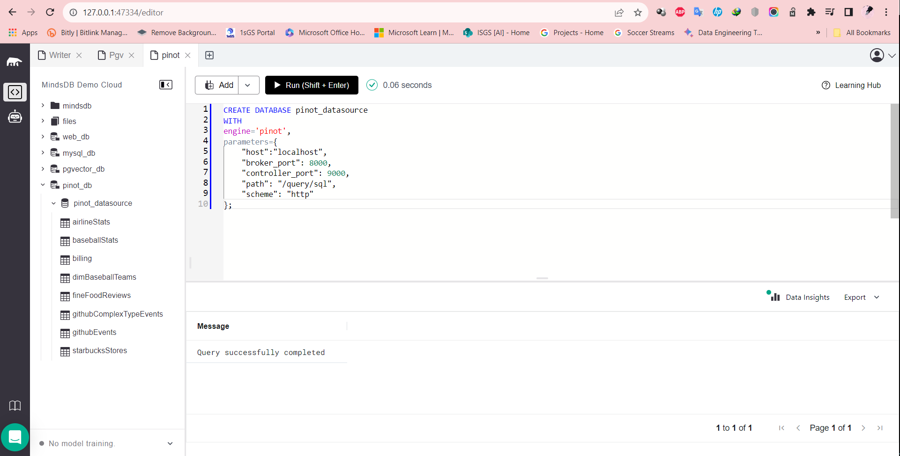
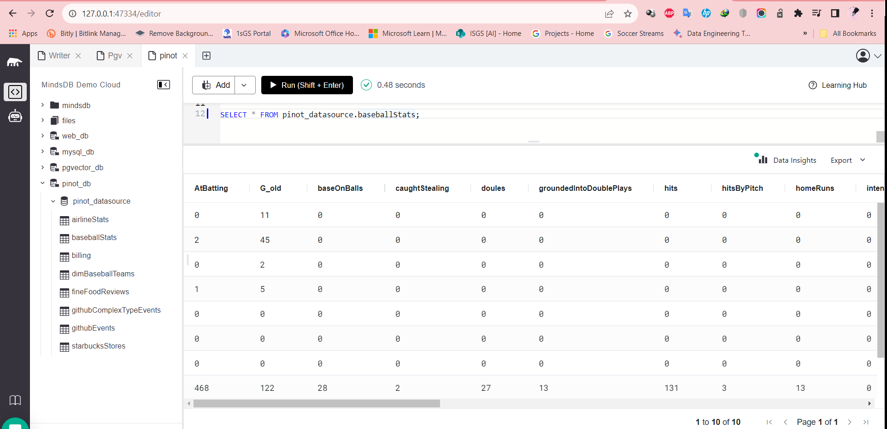

# Testing Apache Pinot Data Integration

This README provides instructions for testing the Apache Pinot data integration in MindsDB.

For more details, refer to the related [GitHub Issue](https://github.com/mindsdb/mindsdb/issues/7702) and the [Apache Pinot documentation](https://docs.mindsdb.com/integrations/data-integrations/apache-pinot) in the MindsDB documentation.

## Test Cases Apache Pinot

-----
### 1. Install the Apache Pinot handler dependencies

**Screeshot Result: Successfully installed**

-----
### 2. Create a Apache Pinot Datasource on MindsDB 

**Description:**
To use this handler and connect to the Apache Pinot server in MindsDB.

**Screeshot Result: Query successfully completed**

-----

### 3. Query Table Apache Pinot Datasource

**Screeshot Result: Query successfully completed**

-----

## Result

The Apache Pinot data integration has been successfully tested, and all test cases are working as expected.
