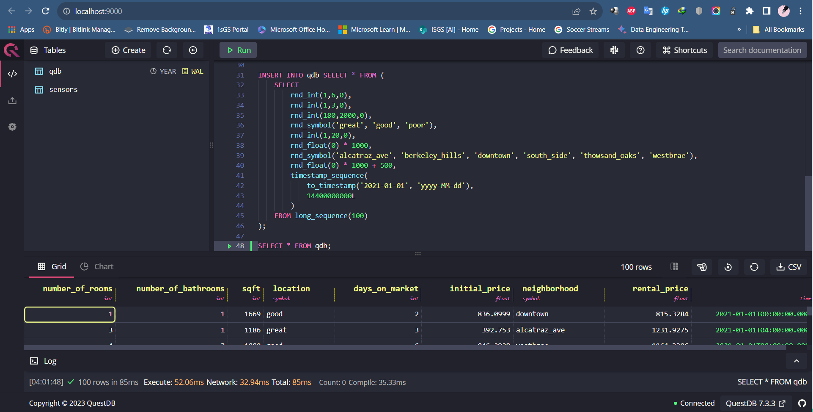
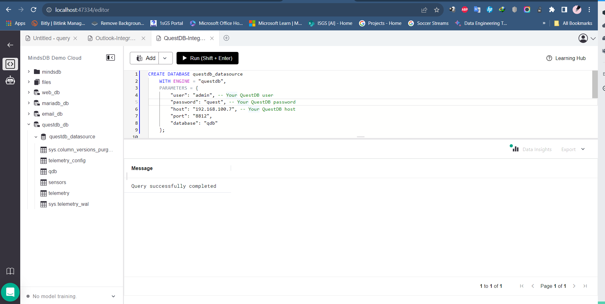
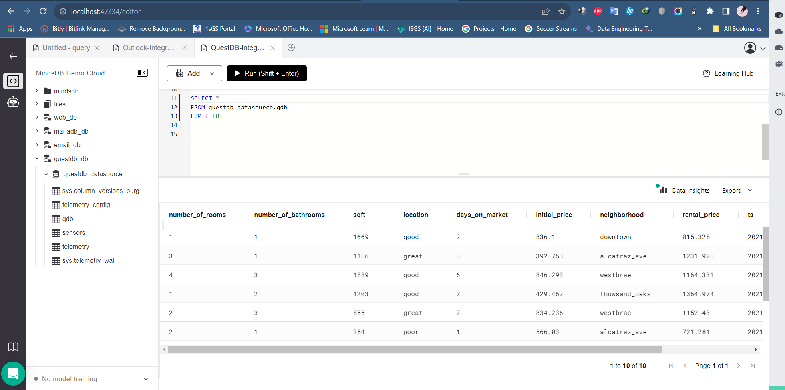

# Testing QuestDB Data Integration

This README provides instructions for testing the QuestDB data integration in MindsDB.

For more details, refer to the related [GitHub Issue](https://github.com/mindsdb/mindsdb/issues/7676) and the [QuestDB documentation](https://docs.mindsdb.com/integrations/data-integrations/questdb) in the MindsDB documentation.

## Test Cases QuestDB

-----
### 1. Create a QuestDB Datasource on MindsDB

**Description:**
To use this handler and connect to the QuestDB server in MindsDB.

**Screeshot Result: Query successfully completed**

-----

### 2. Query My Table on QuestDB Datasource

**Screeshot Result: Query successfully completed**

-----

## Result

The QuestDB data integration has been successfully tested, and all test cases are working as expected.
