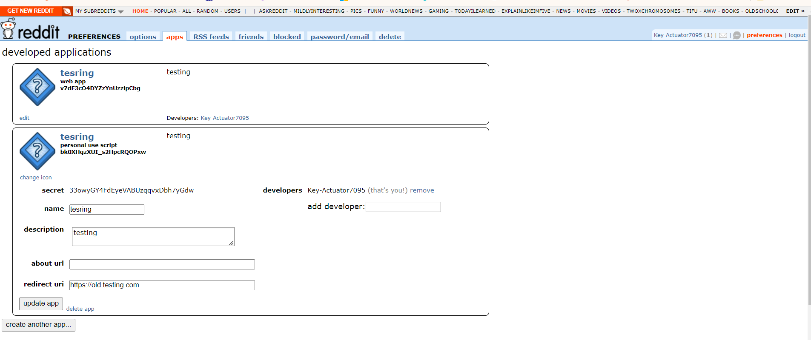
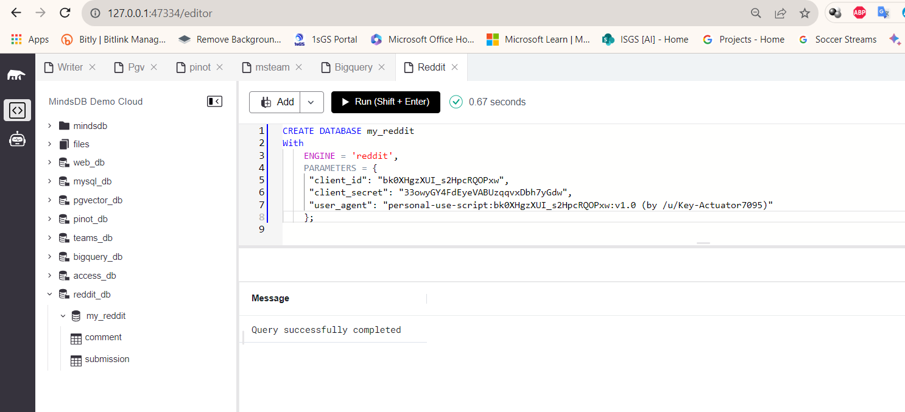
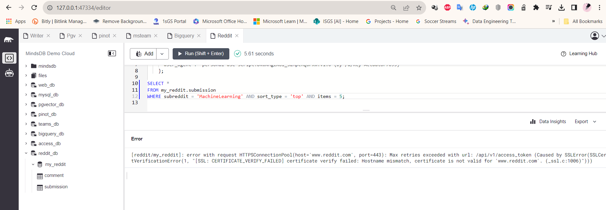

# Test the Reddit app integration

This README provides instructions for testing the Reddit app integration in MindsDB.

For more details, refer to the related [GitHub Issue](https://github.com/mindsdb/mindsdb/issues/7801) and the [Reddit documentation](https://github.com/mindsdb/mindsdb/blob/staging/mindsdb/integrations/handlers/reddit_handler/README.md) in the MindsDB documentation.

## Test Cases Reddit



-----
### 1. Create a Reddit Datasource on MindsDB 

**Description:**
To use this handler and connect to the Reddit in MindsDB.

**Screeshot Result: Query successfully completed**



-----

### 2. Queries to fetch data from Reddit

**Screeshot Result: Error**



**Log Error**

```
WARNING:prawcore:Retrying due to SSLError(MaxRetryError('HTTPSConnectionPool(host=\'www.reddit.com\', port=443): Max retries exceeded with url: /api/v1/access_token (Caused by SSLError(SSLCertVerificationError(1, "[SSL: CERTIFICATE_VERIFY_FAILED] certificate verify failed: Hostname mismatch, certificate is not valid for \'www.reddit.com\'. (_ssl.c:1006)")))')) status: GET https://oauth.reddit.com/r/MachineLearning/top
WARNING:prawcore:Retrying due to SSLError(MaxRetryError('HTTPSConnectionPool(host=\'www.reddit.com\', port=443): Max retries exceeded with url: /api/v1/access_token (Caused by SSLError(SSLCertVerificationError(1, "[SSL: CERTIFICATE_VERIFY_FAILED] certificate verify failed: Hostname mismatch, certificate is not valid for \'www.reddit.com\'. (_ssl.c:1006)")))')) status: GET https://oauth.reddit.com/r/MachineLearning/top
2023-10-26 21:34:38,174 - INFO - Traceback (most recent call last):
  File "D:\Data\Riset\Mindsdb\mindsdb\Lib\site-packages\mindsdb\api\mysql\mysql_proxy\datahub\datanodes\integration_datanode.py", line 141, in query
    result = self.integration_handler.query(query)
             ^^^^^^^^^^^^^^^^^^^^^^^^^^^^^^^^^^^^^
  File "D:\Data\Riset\Mindsdb\mindsdb\Lib\site-packages\mindsdb\integrations\libs\api_handler.py", line 185, in query
    result = self._get_table(query.from_table).select(query)
             ^^^^^^^^^^^^^^^^^^^^^^^^^^^^^^^^^^^^^^^^^^^^^^^
  File "D:\Data\Riset\Mindsdb\mindsdb\Lib\site-packages\mindsdb\integrations\handlers\reddit_handler\reddit_tables.py", line 124, in select
    for submission in submissions:
  File "D:\Data\Riset\Mindsdb\mindsdb\Lib\site-packages\praw\models\listing\generator.py", line 63, in __next__
    self._next_batch()
  File "D:\Data\Riset\Mindsdb\mindsdb\Lib\site-packages\praw\models\listing\generator.py", line 89, in _next_batch
    self._listing = self._reddit.get(self.url, params=self.params)
                    ^^^^^^^^^^^^^^^^^^^^^^^^^^^^^^^^^^^^^^^^^^^^^^
  File "D:\Data\Riset\Mindsdb\mindsdb\Lib\site-packages\praw\util\deprecate_args.py", line 43, in wrapped
    return func(**dict(zip(_old_args, args)), **kwargs)
           ^^^^^^^^^^^^^^^^^^^^^^^^^^^^^^^^^^^^^^^^^^^^
  File "D:\Data\Riset\Mindsdb\mindsdb\Lib\site-packages\praw\reddit.py", line 712, in get
    return self._objectify_request(method="GET", params=params, path=path)
           ^^^^^^^^^^^^^^^^^^^^^^^^^^^^^^^^^^^^^^^^^^^^^^^^^^^^^^^^^^^^^^^
  File "D:\Data\Riset\Mindsdb\mindsdb\Lib\site-packages\praw\reddit.py", line 517, in _objectify_request
    self.request(
  File "D:\Data\Riset\Mindsdb\mindsdb\Lib\site-packages\praw\util\deprecate_args.py", line 43, in wrapped
    return func(**dict(zip(_old_args, args)), **kwargs)
           ^^^^^^^^^^^^^^^^^^^^^^^^^^^^^^^^^^^^^^^^^^^^
  File "D:\Data\Riset\Mindsdb\mindsdb\Lib\site-packages\praw\reddit.py", line 941, in request
    return self._core.request(
           ^^^^^^^^^^^^^^^^^^^
  File "D:\Data\Riset\Mindsdb\mindsdb\Lib\site-packages\prawcore\sessions.py", line 328, in request
    return self._request_with_retries(
           ^^^^^^^^^^^^^^^^^^^^^^^^^^^
  File "D:\Data\Riset\Mindsdb\mindsdb\Lib\site-packages\prawcore\sessions.py", line 254, in _request_with_retries
    return self._do_retry(
           ^^^^^^^^^^^^^^^
  File "D:\Data\Riset\Mindsdb\mindsdb\Lib\site-packages\prawcore\sessions.py", line 162, in _do_retry
    return self._request_with_retries(
           ^^^^^^^^^^^^^^^^^^^^^^^^^^^
  File "D:\Data\Riset\Mindsdb\mindsdb\Lib\site-packages\prawcore\sessions.py", line 254, in _request_with_retries
    return self._do_retry(
           ^^^^^^^^^^^^^^^
  File "D:\Data\Riset\Mindsdb\mindsdb\Lib\site-packages\prawcore\sessions.py", line 162, in _do_retry
    return self._request_with_retries(
           ^^^^^^^^^^^^^^^^^^^^^^^^^^^
  File "D:\Data\Riset\Mindsdb\mindsdb\Lib\site-packages\prawcore\sessions.py", line 234, in _request_with_retries
    response, saved_exception = self._make_request(
                                ^^^^^^^^^^^^^^^^^^^
  File "D:\Data\Riset\Mindsdb\mindsdb\Lib\site-packages\prawcore\sessions.py", line 186, in _make_request
    response = self._rate_limiter.call(
               ^^^^^^^^^^^^^^^^^^^^^^^^
  File "D:\Data\Riset\Mindsdb\mindsdb\Lib\site-packages\prawcore\rate_limit.py", line 46, in call
    kwargs["headers"] = set_header_callback()
                        ^^^^^^^^^^^^^^^^^^^^^
  File "D:\Data\Riset\Mindsdb\mindsdb\Lib\site-packages\prawcore\sessions.py", line 282, in _set_header_callback
    self._authorizer.refresh()
  File "D:\Data\Riset\Mindsdb\mindsdb\Lib\site-packages\prawcore\auth.py", line 378, in refresh
    self._request_token(grant_type="client_credentials", **additional_kwargs)
  File "D:\Data\Riset\Mindsdb\mindsdb\Lib\site-packages\prawcore\auth.py", line 155, in _request_token
    response = self._authenticator._post(url=url, **data)
               ^^^^^^^^^^^^^^^^^^^^^^^^^^^^^^^^^^^^^^^^^^
  File "D:\Data\Riset\Mindsdb\mindsdb\Lib\site-packages\prawcore\auth.py", line 51, in _post
    response = self._requestor.request(
               ^^^^^^^^^^^^^^^^^^^^^^^^
  File "D:\Data\Riset\Mindsdb\mindsdb\Lib\site-packages\prawcore\requestor.py", line 70, in request
    raise RequestException(exc, args, kwargs) from None
prawcore.exceptions.RequestException: error with request HTTPSConnectionPool(host='www.reddit.com', port=443): Max retries exceeded with url: /api/v1/access_token (Caused by SSLError(SSLCertVerificationError(1, "[SSL: CERTIFICATE_VERIFY_FAILED] certificate verify failed: Hostname mismatch, certificate is not valid for 'www.reddit.com'. (_ssl.c:1006)")))

The above exception was the direct cause of the following exception:

Traceback (most recent call last):
  File "D:\Data\Riset\Mindsdb\mindsdb\Lib\site-packages\mindsdb\api\http\namespaces\sql.py", line 40, in post
    result = mysql_proxy.process_query(query)
             ^^^^^^^^^^^^^^^^^^^^^^^^^^^^^^^^
  File "D:\Data\Riset\Mindsdb\mindsdb\Lib\site-packages\mindsdb\utilities\profiler\profiler.py", line 138, in wrapper
    result = function(*args, **kwargs)
             ^^^^^^^^^^^^^^^^^^^^^^^^^
  File "D:\Data\Riset\Mindsdb\mindsdb\Lib\site-packages\mindsdb\api\mysql\mysql_proxy\mysql_proxy.py", line 495, in process_query
    executor.query_execute(sql)
  File "D:\Data\Riset\Mindsdb\mindsdb\Lib\site-packages\mindsdb\utilities\profiler\profiler.py", line 138, in wrapper
    result = function(*args, **kwargs)
             ^^^^^^^^^^^^^^^^^^^^^^^^^
  File "D:\Data\Riset\Mindsdb\mindsdb\Lib\site-packages\mindsdb\api\mysql\mysql_proxy\executor\executor.py", line 116, in query_execute
    self.do_execute()
  File "D:\Data\Riset\Mindsdb\mindsdb\Lib\site-packages\mindsdb\utilities\profiler\profiler.py", line 138, in wrapper
    result = function(*args, **kwargs)
             ^^^^^^^^^^^^^^^^^^^^^^^^^
  File "D:\Data\Riset\Mindsdb\mindsdb\Lib\site-packages\mindsdb\api\mysql\mysql_proxy\executor\executor.py", line 213, in do_execute
    ret = self.command_executor.execute_command(self.query)
          ^^^^^^^^^^^^^^^^^^^^^^^^^^^^^^^^^^^^^^^^^^^^^^^^^
  File "D:\Data\Riset\Mindsdb\mindsdb\Lib\site-packages\mindsdb\utilities\profiler\profiler.py", line 138, in wrapper
    result = function(*args, **kwargs)
             ^^^^^^^^^^^^^^^^^^^^^^^^^
  File "D:\Data\Riset\Mindsdb\mindsdb\Lib\site-packages\mindsdb\api\mysql\mysql_proxy\executor\executor_commands.py", line 601, in execute_command
    query = SQLQuery(statement, session=self.session)
            ^^^^^^^^^^^^^^^^^^^^^^^^^^^^^^^^^^^^^^^^^
  File "D:\Data\Riset\Mindsdb\mindsdb\Lib\site-packages\mindsdb\api\mysql\mysql_proxy\classes\sql_query.py", line 463, in __init__
    self.execute_query()
  File "D:\Data\Riset\Mindsdb\mindsdb\Lib\site-packages\mindsdb\api\mysql\mysql_proxy\classes\sql_query.py", line 685, in execute_query
    raise e
  File "D:\Data\Riset\Mindsdb\mindsdb\Lib\site-packages\mindsdb\api\mysql\mysql_proxy\classes\sql_query.py", line 679, in execute_query
    data = self.execute_step(step, steps_data)
           ^^^^^^^^^^^^^^^^^^^^^^^^^^^^^^^^^^^
  File "D:\Data\Riset\Mindsdb\mindsdb\Lib\site-packages\mindsdb\api\mysql\mysql_proxy\classes\sql_query.py", line 764, in execute_step
    data = self._fetch_dataframe_step(step, steps_data)
           ^^^^^^^^^^^^^^^^^^^^^^^^^^^^^^^^^^^^^^^^^^^^
  File "D:\Data\Riset\Mindsdb\mindsdb\Lib\site-packages\mindsdb\api\mysql\mysql_proxy\classes\sql_query.py", line 573, in _fetch_dataframe_step
    data, columns_info = dn.query(
                         ^^^^^^^^^
  File "D:\Data\Riset\Mindsdb\mindsdb\Lib\site-packages\mindsdb\utilities\profiler\profiler.py", line 138, in wrapper
    result = function(*args, **kwargs)
             ^^^^^^^^^^^^^^^^^^^^^^^^^
  File "D:\Data\Riset\Mindsdb\mindsdb\Lib\site-packages\mindsdb\api\mysql\mysql_proxy\datahub\datanodes\integration_datanode.py", line 150, in query
    raise DBHandlerException(msg) from e
mindsdb.api.mysql.mysql_proxy.datahub.datanodes.integration_datanode.DBHandlerException: [reddit/my_reddit]: error with request HTTPSConnectionPool(host='www.reddit.com', port=443): Max retries exceeded with url: /api/v1/access_token (Caused by SSLError(SSLCertVerificationError(1, "[SSL: CERTIFICATE_VERIFY_FAILED] certificate verify failed: Hostname mismatch, certificate is not valid for 'www.reddit.com'. (_ssl.c:1006)")))
```
-----

## Result

The Reddit app integration test has failed.
