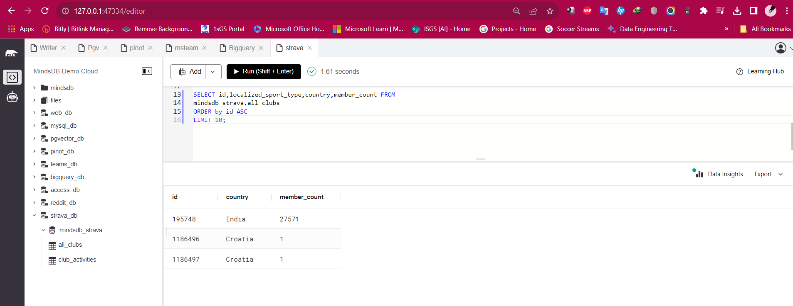

# Test the Strava app integration

This README provides instructions for testing the Strava app integration in MindsDB.

For more details, refer to the related [GitHub Issue](https://github.com/mindsdb/mindsdb/issues/8150) and the [Strava Handler documentation](https://github.com/mindsdb/mindsdb/blob/staging/mindsdb/integrations/handlers/strava_handler/Readme.md) in the MindsDB documentation.

## Test Cases Strava

-----
### 1. Create a Strava app integration on MindsDB 

**Description:**
To use this handler and connect to the Strava app in MindsDB.

**Screeshot Result: Successfully installed**

-----
### 2. Query the Strava all_clubs table

**Screeshot Result: Query successfully completed**

-----

### 3. Query the Strava club_activities table

**Screeshot Result: Query successfully completed**

-----

### 4. Advanced queries for the Strava handler

**Screeshot Result: Query successfully completed**

-----

## Result

The Strava app integration has been successfully tested, and all test cases are working as expected.
