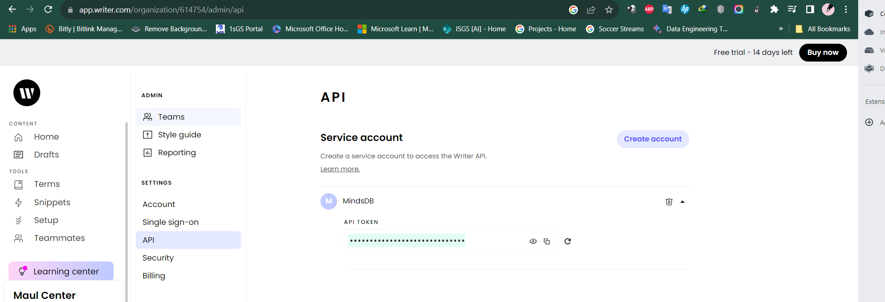
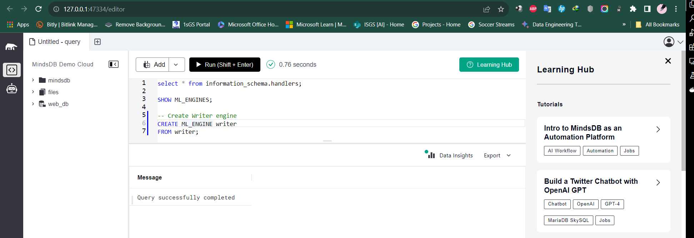
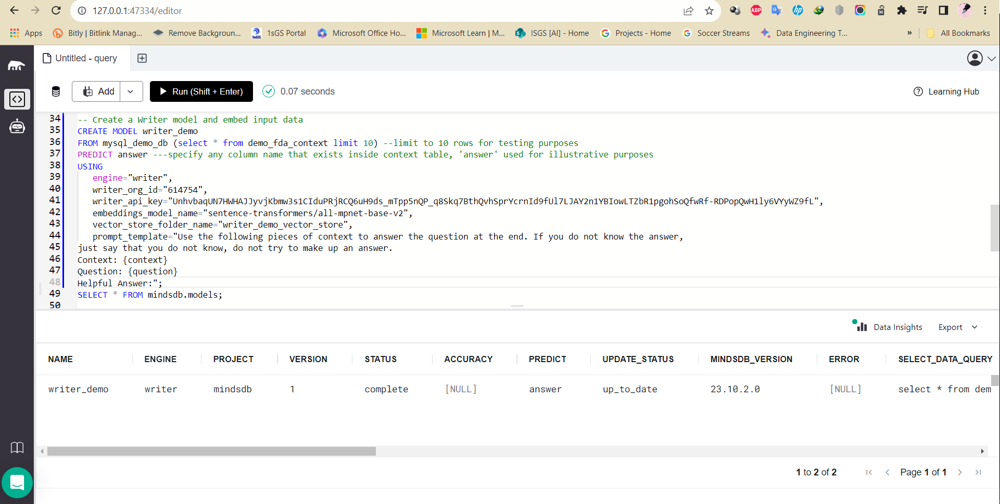
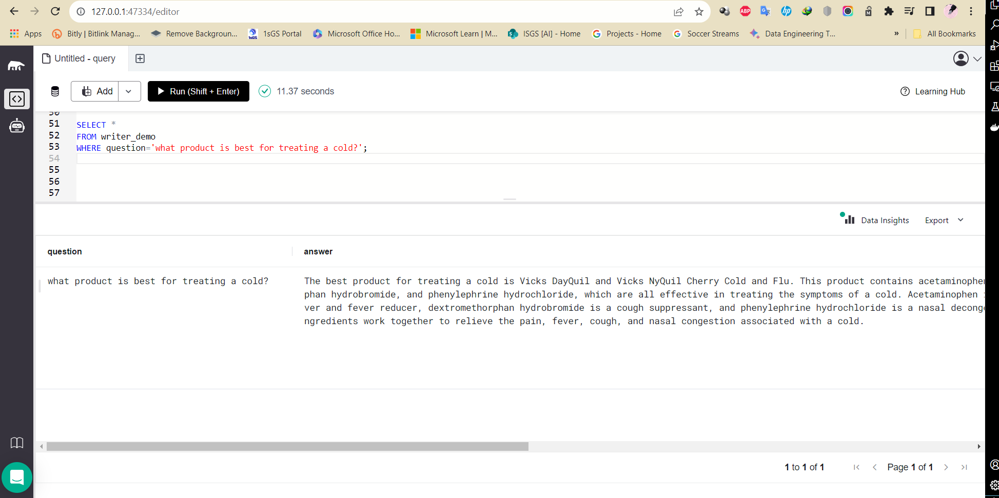

# Test the Writer.ai ML integration

This README provides instructions for testing the Writer.ai ML integration in MindsDB.

For more details, refer to the related [GitHub Issue](https://github.com/mindsdb/mindsdb/issues/7623) and the [Writer.ai README.md](https://github.com/mindsdb/mindsdb/blob/staging/mindsdb/integrations/handlers/writer_handler/README.md) in the MindsDB documentation.

## Test Cases Writer.ai

-----
### 1. Create Writer.ai engine on MindsDB

**Screeshot Result: Query successfully completed**

-----

### 2. Create a Writer.ai model and embed input data

**Screeshot Result: Model creation completed**

-----

### 3. Ask a question on your data using Writer.ai LLM API

**Screeshot Result: Model generates the predicted answer**

-----
## Result

The Writer.ai ML integration has been successfully tested, and all test cases are working as expected.
